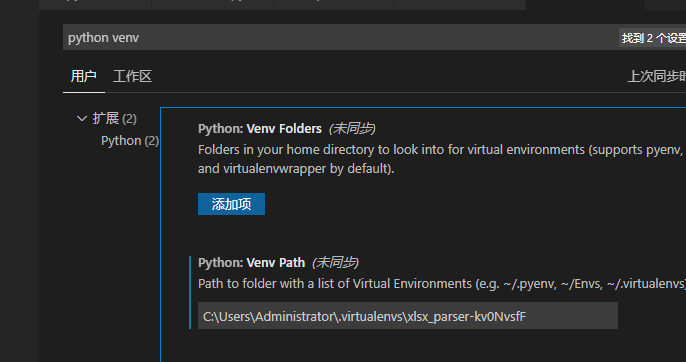
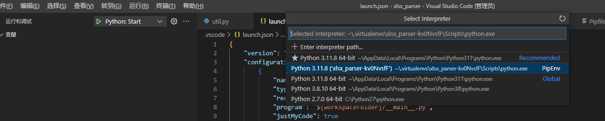

## 一、 配置表规范

### 1.总览

#### 使用方式

在配置表中配置每行数据对应的类型，在生成定义文件中定义配置的生成格式，通过命令行调用打包好的exe输出生成之后的文件

#### 配置表配置

配置表的A1单元格为定义格,必须以##为开头，可填写多个参数，参数之间以##分割  支持column，将表格识别为纵表，支持

row，将表格识别为横表，默认为横表

每行的a单元格为tag格，当tag格为## 忽视当前行

必须要存在tag格为##var的标题定义行，标题定义行的元素除了tag格，以##开头意味着忽略当前列

支持配置的类型 分为 int，str，arrayInt，arrayStr 四种

#### 生成定义配置

通过读取配置定义文件来决定配置表的具体生成，配置定义文件本身就是一张配置表，它的model为list，index为name
name 指定配置表生成名字。
input指定读取的配置表文件。
mode指定配置表生成的格式，支持list 和map两种格式。
index指定配置表主键，支持单主键，多主键，联合主键三种格式，多主键配置格式为key1，key2，联合主键配置格式为key1+key2

### 2.生成文件

#### 生成参数

生成参数有5个，第一个参数指定读取的配置定义文件，第二个参数指定需要生成的配置表所在根目录， 第三个参数指定需要生成的配置表名字，，第四个参数指定生成出来的配置的所在文件，第五个参数指定生成出来的配置的格式，支持json和bin两种

## 二、构建环境搭建

### 1.安装pipenv工具（已安装跳过）

pip3 install pipenv

### 2.进入当前目录,安装依赖包

pipenv install

### 3.初始化调试环境

#### 先激活Pipenv环境

pipenv shell

#### 获取当前虚拟环境的位置

pipenv --venv

#### 设置vscode编辑器环境

1.Ctrl+Shift+P，输入settings，选择Open Settings(UI)，设置pipenv --venv获取到的路径

2.Ctrl+Shift+P，输入Python Select Interpreter，选择刚刚的虚拟路径

3.安装Black Formatter，并设置为vscode的python格式化插件，启动保存时格式化功能
